<p align="center">
  
</p>

<h1 align="center">homefront</h1>

<p align="center">
  A self-hosted control room for a living room built around a Windows HTPC.<br>
  Lights, the TV, the media library and the PC itself, from any browser on any device.
</p>

<p align="center">
  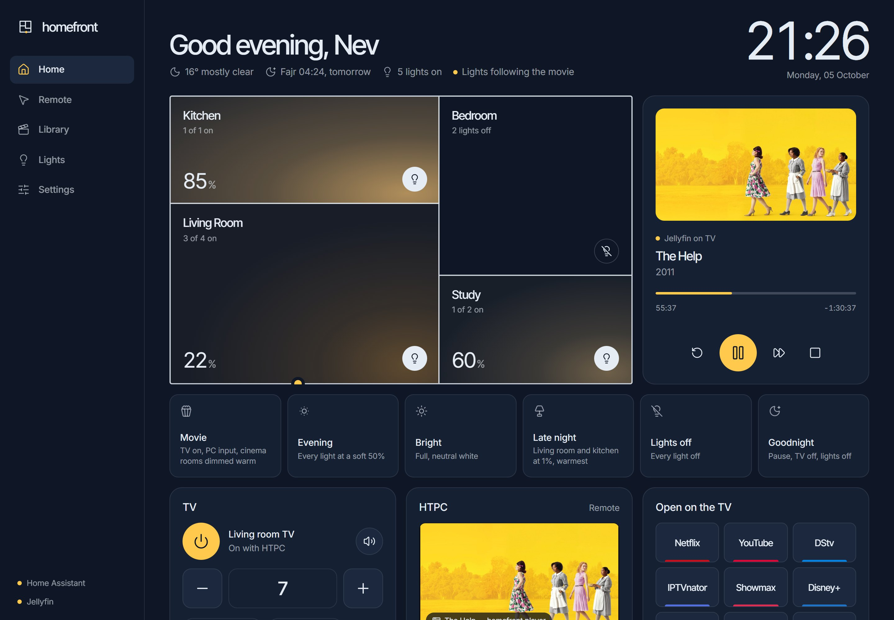
</p>

<p align="center">
  <a href="docs/README.md"><b>Documentation</b></a> ·
  <a href="docs/user-guide.md">User guide</a> ·
  <a href="docs/install.md">Install</a> ·
  <a href="docs/automations.md">Automations</a> ·
  <a href="docs/remote-access.md">Remote access</a> ·
  <a href="docs/troubleshooting.md">Troubleshooting</a>
</p>

## What it does

homefront runs on the HTPC that's plugged into the TV and becomes the one place to control everything around it. Open it on a phone, a laptop, a tablet or the TV itself. Home Assistant handles devices and automations underneath, so the house keeps working even when homefront doesn't.

### The house

- **A live floor plan.** Each room glows with the real colour temperature and brightness of its bulbs. Tap a room for per-bulb brightness, warmth and colour. A lamplight-yellow dot on the wall marks the room where something is playing.
- **Scenes.** Movie (TV on, HTPC input, cinema rooms dimmed warm), Evening, Bright, Late night (living room and kitchen at 1% and the warmest white, everything else off), Lights off, Goodnight (pause, TV off, lights off).
- **Lights that follow what's playing.** When a video plays on the HTPC, the TV room dims; pausing lifts it a little; stopping puts every bulb back exactly as it was. It only ever dims, so Late night at 1% stays at 1%, and lights that were off stay off. If you change the lights mid-film, that becomes the state it returns to.
- **Sunset fade.** From twenty minutes before sunset, if the TV is on and the living room is dark, the lights climb one small step a minute to a warm 60%. If you were already watching, it runs to the end through pauses and new episodes; if a film starts from scratch, it hands over to follow-what's-playing. Touch the lights yourself and it stops.
- **Wake-up light.** Choose when you want to be up, the days and how long the fade is; the bedroom ramps from a dim warm glow to bright daylight. The settings live in Home Assistant, so it runs even if homefront is down.

<p align="center">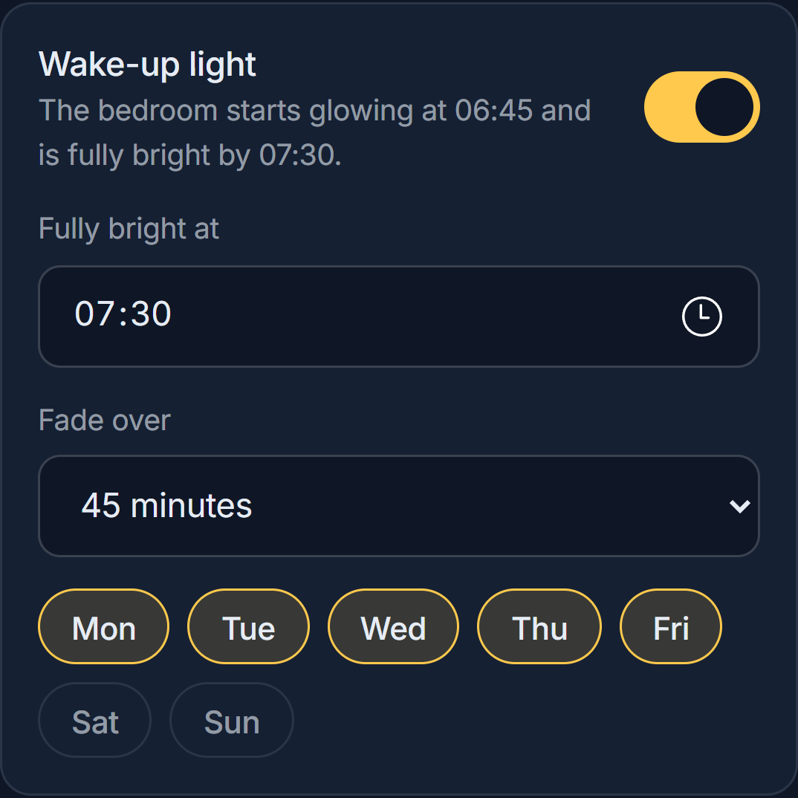</p>

### The TV and the HTPC

- **A remote that feels like a remote.** On a phone it opens as a big touchpad: drag to move, tap to click, two fingers or the edge strip to scroll, hold to right-click, tap-then-drag to drag. A live keyboard sends every key as you press it (with Ctrl, Alt, Win, arrows and F11 on hand), and **Paste** types your phone's clipboard into whatever is focused on the TV. A Screen tab mirrors the TV when you can't see it; a Buttons tab is a classic arrows-and-OK remote. Media and volume controls sit under every tab.
- **TV control** for LG webOS TVs: power, input, screen-off-with-sound, and big − / + volume buttons around a level you can type. Switching on keeps sending wake-up packets until the TV answers, because a TV in deep standby often ignores the first one.
- **Open anything on the TV.** One tap opens Netflix, YouTube, DStv and friends in the HTPC's everyday browser with your logins, or desktop apps like Spotify, IPTVnator and VLC (`app:spotify`, `app:iptvnator`, `app:vlc`). Paste any link to send it to the screen.
- **Now playing, whatever it is.** Shows what the HTPC is playing right now, even for apps that don't tell Windows (Spotify, VLC, IPTVnator), detected from which apps are making sound. Artwork comes from the app, or songs are matched on iTunes or Deezer and videos against your Jellyfin library. Only real video (browser video sites, IPTVnator, VLC, Jellyfin, Plex, Kodi and other players) drives the lights; music, games and calls don't.
- **Ambient mode** turns the TV into a quiet wall clock with weather, the next prayer time and a miniature of the floor plan. Underneath, a row of things to continue watching (or what's new): arrow keys pick, Enter plays, Escape closes.
- **Sleep timer.** "Everything off in 45 minutes": pause, TV off, lights fade out, with a one-minute warning on the TV.

<p align="center">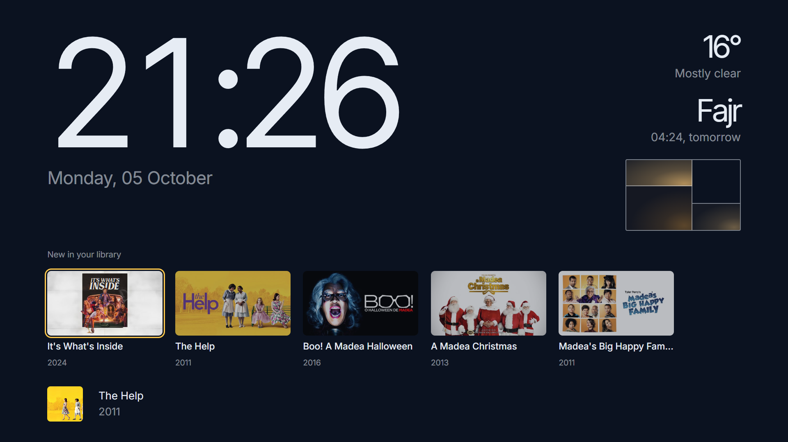</p>

### The library

- **Your Jellyfin library, played on the TV.** Browse, search and press *Play on TV*. A full-screen player opens on the HTPC, controlled from your phone. It resumes where you left off, reports progress to Jellyfin and moves to the next episode on its own. Subtitles come on in your language by default; switch subtitle or audio tracks from the phone (picture-based DVD and PGS subtitles are drawn into the video).

### Your phone, your watch, your car

- **Alerts** through the Home Assistant app: camera motion with a snapshot, new episodes, a light that stopped responding, homefront not answering. Routine alerts wait out quiet hours (23:00–07:00); motion while nobody is home always comes through.
- **Lights left on.** When you leave, your phone says which lights are still on, with *Turn everything off* and *Leave them on* buttons.
- **Lock screen, Control Centre, Apple Watch, Siri and Assist** run any scene or action through Home Assistant scripts ("Hey Siri, movie time").
- **CarPlay.** Getting in the car at home pauses the HTPC and sends the lights-left-on nudge straight away. Driving home after dark, about a kilometre out, the living room and kitchen come on and the TV wakes up showing the clock. Parking counts you as home immediately.

### Everything else

- **Cameras.** Any camera in Home Assistant shows live in homefront, and motion while you're watching appears on the TV.
- **Weather and prayer times** with no API keys (Open-Meteo and Aladhan). Sehri and Iftar appear automatically during Ramadan. Optional, all off by default: a notice on the TV at prayer times, pausing playback, and an Iftar countdown on the TV.
- **Guest passes.** A time-limited pass with a QR code signs a guest in with lights, TV and media. Settings and power stay with the owner. Turn a pass off and it stops working immediately.
- **Guided light setup.** Tuya / Smart Life bulbs are linked from inside homefront: paste the Smart Life user code and scan the QR code it shows.

## Screenshots

| | |
|---|---|
| 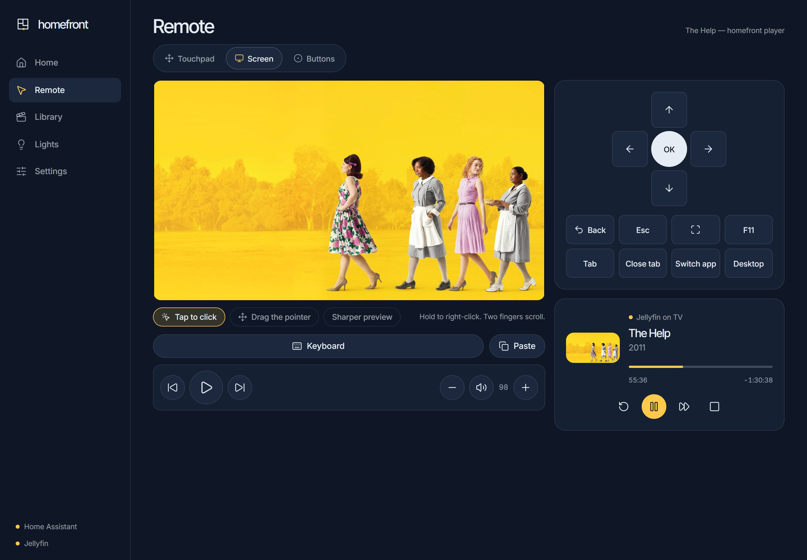 | 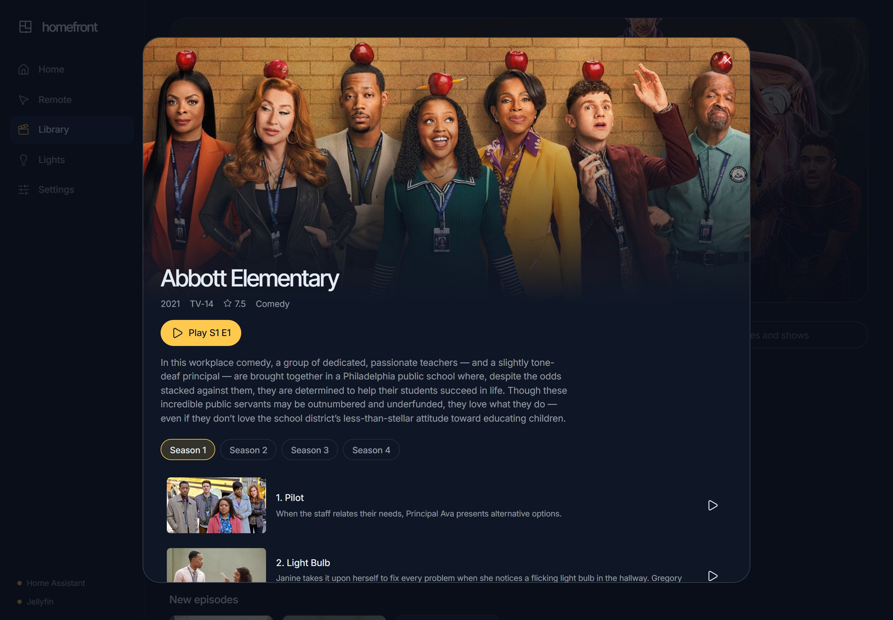 |
| **Remote, Screen view.** Tap the mirror to click on the TV. | **Library.** Play on the TV, resume or start over. |
| 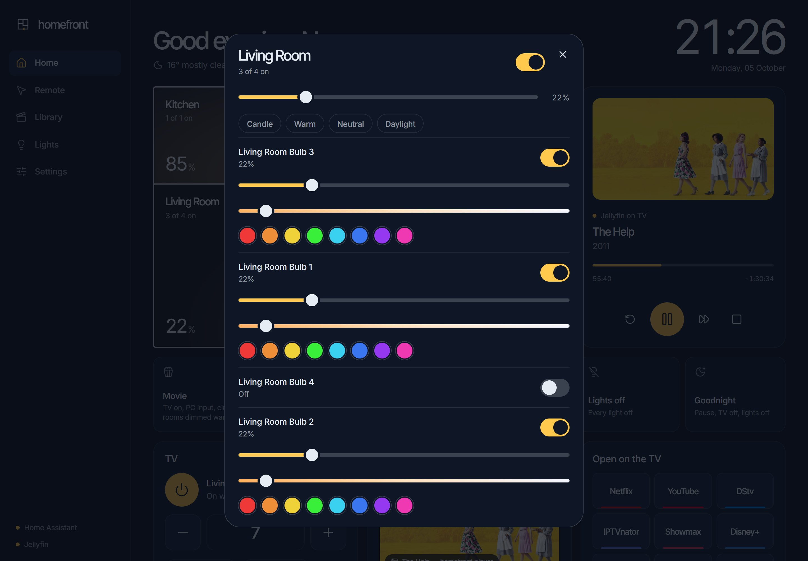 | 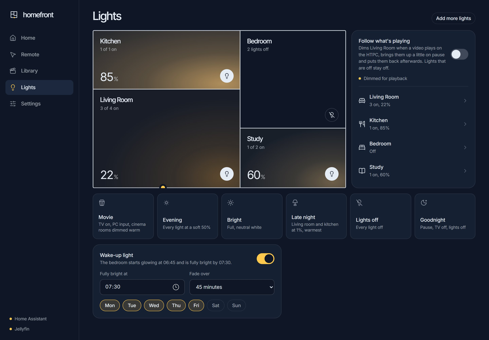 |
| **Rooms.** Every bulb, or the whole room at once. | **Lights,** scenes and the wake-up light. |

<p align="center">
  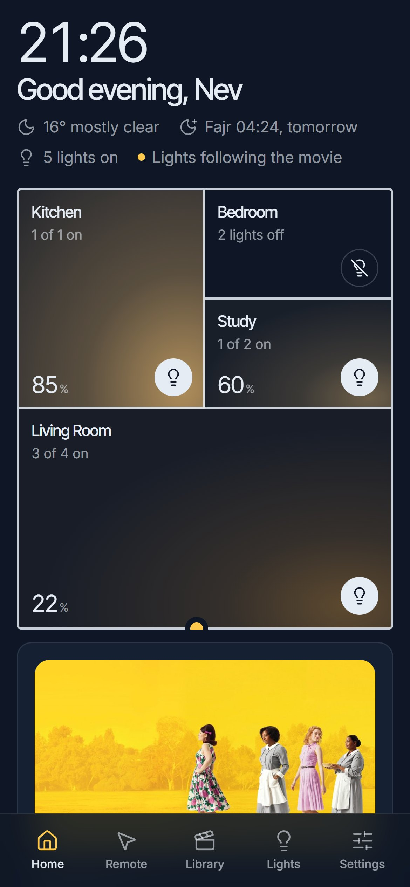
  &nbsp;
  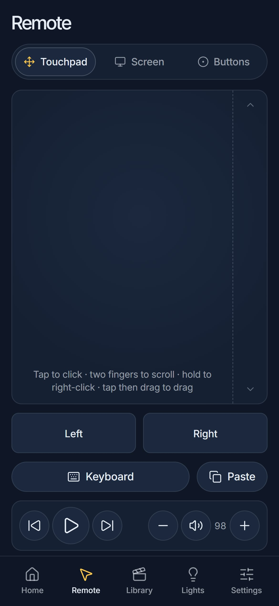
  &nbsp;
  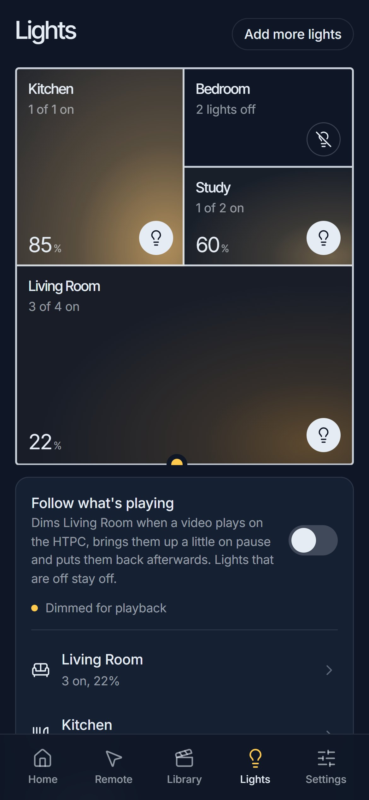
</p>

<details>
<summary>The whole home screen</summary>

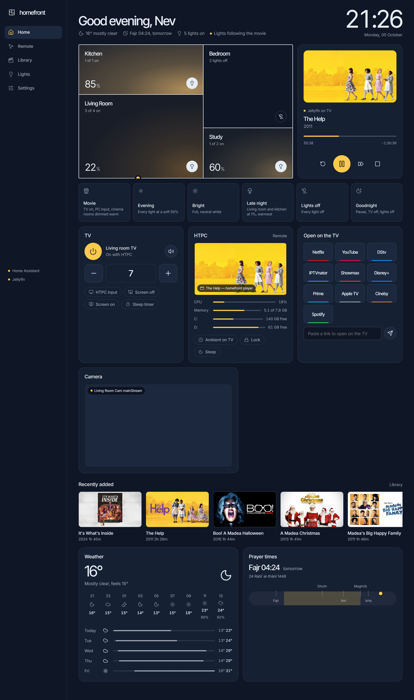
</details>

## How it fits together

```
 phone / laptop / TV browser                      iPhone: Home Assistant app, Watch, CarPlay, Siri
            │  HTTP + one WebSocket                          │  push alerts, scripts, location
            ▼                                                ▼
 ┌──────────── homefront.exe (HTPC desktop session) ────────────┐   ┌──── Home Assistant (VM on the HTPC) ────┐
 │ Windows: media sessions · audio levels · SendInput · capture │◄─►│ lights (Tuya) · TV (webOS) · camera      │
 │ Jellyfin client + HLS proxy · Brave launcher and kiosk       │   │ automations · alerts · presence · voice  │
 │ LGTV Companion CLI + wake-on-LAN · Open-Meteo · Aladhan      │   │ homefront_command / homefront_* sensors  │
 └──────────────────────────────────────────────────────────────┘   └──────────────────────────────────────────┘
```

- **Server:** .NET 10 minimal API, published as one self-contained `homefront.exe` (no runtime to install). It runs in the logged-in desktop session, because that's where the screen, audio and media sessions live.
- **Front end:** Preact with htm and plain ES modules. No build step, and every dependency is vendored, so nothing loads from a CDN apart from the Inter font.
- **Live state:** one WebSocket to Home Assistant; changes are pushed to every open dashboard over its own socket.
- **Both ways with Home Assistant:** homefront publishes the HTPC's state (playing, CPU, memory, free disk, sleep timer, heartbeat) as `homefront_*` sensors. Home Assistant drives homefront by firing a `homefront_command` event: `scene`, `sleep_timer`, `ambient`, `close_kiosk`, `open`, `pause`, `play`, `tv_on`, `welcome`, `cinema_resume`. New Jellyfin arrivals fire `homefront_new_media`. The full list is in [docs/automations.md](docs/automations.md).
- **Playback:** Jellyfin decides per title whether to copy the streams or transcode (Intel Quick Sync on the HTPC). The kiosk player plays the result with hls.js through a homefront proxy, so the browser only ever talks to homefront.

## Requirements

- A Windows 10/11 PC that stays logged in (the HTPC)
- [Home Assistant](https://www.home-assistant.io/) on the network, with your lights and the TV integrated
- Optional: [Jellyfin](https://jellyfin.org/) for the library and player
- Optional: [LGTV Companion](https://github.com/JPersson77/LGTVCompanion) for LG TV power, input and screen-off
- [Brave](https://brave.com/) on the HTPC for launching sites and the kiosk player (any Chromium browser works; set its path in `config.json`)

## Install

The short version is below; [docs/install.md](docs/install.md) walks through a whole home, from the HTPC to the phone.

1. **Build** on any Windows machine with the .NET 10 SDK:
   ```powershell
   cd server
   dotnet publish -c Release -o ..\publish
   ```
2. **Copy** the `publish` folder to the HTPC, for example `C:\Users\<you>\homefront`.
3. **Run** `homefront.exe` once. It creates `data\config.json` and starts on port 80.
4. **Configure** `data\config.json`, then restart homefront:
   ```jsonc
   {
     "homeName": "Home",
     "ownerName": "Sam",
     "ha": {
       "urls": ["http://homeassistant.local:8123"],
       "token": "<Home Assistant long-lived access token>",
       "tvEntity": "media_player.lg_webos_tv"
     },
     "jellyfin": {
       "url": "http://127.0.0.1:8096",
       "apiKey": "<access token from /Users/AuthenticateByName>",
       "userId": "<your Jellyfin user id>"
     },
     "location": { "name": "Johannesburg", "lat": -26.2, "lon": 28.05 }
   }
   ```
   Everything else (rooms, shortcuts, prayer method, cinema rooms, guest passes, password) is editable in the app under **Settings**.
5. **Start at login:** put a shortcut to `homefront.exe` in `shell:startup`, and allow TCP 80 inbound on private networks in Windows Firewall.
6. Open `http://<htpc-name>` and sign in with **admin / homefront**. **Change the password in Settings straight away.**

### Rooms and lights

Rooms are matched by name: a bulb called *Kitchen 1* lands in Kitchen automatically. Anything else can be assigned in Settings. The first room is the large one on the floor plan and the default cinema room.

### Away from home

homefront is meant for a private network. To reach it from outside, use [Tailscale](https://tailscale.com/) rather than port forwarding. `tailscale serve --bg 80` gives it an HTTPS address on your tailnet, which also lets phones install it as an app and paste from the clipboard. More homes, sharing with family, and the phone setup are in [docs/remote-access.md](docs/remote-access.md).

## Security

- Every API and the live socket require a signed session cookie (HMAC-SHA256, HttpOnly, SameSite=Lax). Passwords are stored as PBKDF2-SHA256 hashes.
- Requests from the HTPC itself are trusted, so its kiosk pages work without signing in. Requests forwarded by a reverse proxy (`X-Forwarded-*` or Tailscale headers) are never treated as local.
- Guests can't change settings, put the PC to sleep, or link lights. Turning off or deleting a pass revokes it immediately.
- Tokens for Home Assistant and Jellyfin live only in `data\config.json` on the HTPC, which is ignored by git.
- homefront can move the mouse and type on the HTPC. Don't expose it to the internet.

## Development

```
server/
  Program.cs          endpoints, auth gate, live socket, background loops, Home Assistant commands
  HomeAssistant.cs    WebSocket client with reconnect and state cache
  Jellyfin.cs         library, images, playback source, subtitles, progress reporting
  Automation.cs       rooms, scenes and follow-what's-playing
  Extras.cs           sleep timer, TV notices, prayer times, cameras, Home Assistant sensors
  WinMedia.cs         what's playing: media sessions, player windows, apps making sound
  Art.cs              cover art from iTunes, Deezer and Jellyfin
  WinSystem.cs        volume, input injection, screen capture, power, stats
  Apps.cs             browser launching, kiosk window, LGTV Companion and wake-on-LAN
  Feeds.cs            weather and prayer times
  wwwroot/            the app: index.html, app.css, js/ (Preact + htm, no build)
tools/
  build-icons.mjs     bundles the Lucide icons the UI uses into js/icons.mjs
  screenshots.mjs     regenerates docs/screenshots with Playwright and Edge
  audit.mjs           layout audit: 134 page states across 9 screen sizes, from a 320 px phone to a 1080p TV
docs/                 user guide, install, automations, remote access, troubleshooting
```

Front-end changes need no build: edit `server/wwwroot` and refresh. To regenerate the screenshots or run the audit, start a local instance on port 8090 with automations switched off, then run `node tools/screenshots.mjs` or `node tools/audit.mjs`.

## Credits

[Preact](https://preactjs.com/), [htm](https://github.com/developit/htm), [hls.js](https://github.com/video-dev/hls.js), [Lucide](https://lucide.dev/) icons, [QRCoder](https://github.com/codebude/QRCoder), [Open-Meteo](https://open-meteo.com/), [Aladhan](https://aladhan.com/prayer-times-api), [LGTV Companion](https://github.com/JPersson77/LGTVCompanion).

## License

MIT
