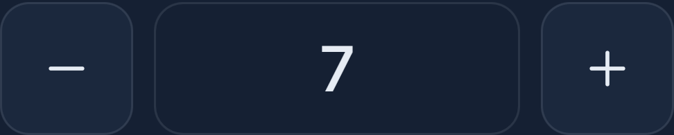

# User guide

homefront opens from its icon on your phone's home screen, or at the house's homefront address in any browser. Everything below works the same on a phone, a tablet, a laptop and the TV.

## Home

The home screen is the house at a glance.

- **The floor plan.** Each room glows with the colour and brightness of its lights. Tap a room to change its lights; tap the bulb button in a corner to switch the whole room on or off. A yellow dot on a wall marks the room where something is playing.
- **Now playing.** Whatever the HTPC is playing, with artwork and controls: play, pause, skip, seek, and **CC** for subtitles and audio language when it's homefront's own player.
- **Scenes.** One tap sets the whole house:

| Scene | What it does |
| --- | --- |
| Movie | TV on with the HTPC, the TV room dimmed warm, other rooms off |
| Evening | Every light at a soft 50% |
| Bright | Everything full, neutral white |
| Late night | Living room and kitchen at 1% and the warmest white; everything else off |
| Lights off | Every light off |
| Goodnight | Pauses what's playing, turns the TV off, switches every light off |

- **TV.** Power, the HTPC input, screen off (sound stays on) and the sleep timer. Volume is the big **−** and **+**: tap to step, hold to keep going, or tap the number, type a level and press Return.

- **HTPC.** A live view of the screen, PC volume, the **Ambient on TV** clock, and the tiles that open Netflix, YouTube, DStv, IPTVnator, Spotify and the rest on the TV.

## Remote

On a phone, the remote opens as a touchpad, so you can watch the TV rather than the phone.

| Do this | To |
| --- | --- |
| Drag one finger | Move the pointer |
| Tap | Click |
| Tap, then drag straight away | Drag (windows, sliders, selecting text) |
| Two fingers, or the strip down the right edge | Scroll |
| Hold, or tap with two fingers | Right-click |

- **Left** and **Right** under the pad are mouse buttons. Holding Left lets you drag too.
- **Keyboard** opens your phone's keyboard; every key goes to the TV as you press it, including Backspace and Enter. Extra keys appear above it: Ctrl, Alt, Win, Esc, Tab, the arrows and F11. Tap Ctrl then C for Ctrl+C.
- **Paste** types your phone's clipboard into whatever is selected on the TV. iPhone asks you to confirm with a small *Paste* bubble. On the plain home address (not the Tailscale one), a field appears instead: long-press it and choose Paste.
- **Under every tab:** previous, play/pause and next, plus PC volume down, mute and up.

The **Screen** tab mirrors the TV, for when you can't see it: tap anything on the picture to click it there. The **Buttons** tab is a classic remote: arrows, OK, Back, Esc, full screen, Close tab, Switch app and Desktop. homefront remembers the tab you used last.

## Library

Your films and series. Search, browse, and tap a title for details, seasons and episodes. **Play on TV** opens the full-screen player on the HTPC and puts the controls on your phone. It remembers where you stopped, plays the next episode on its own, and switches subtitles and audio language from **CC**. Subtitles come on in your language by default.

## Lights

- **Rooms and scenes,** as on the home screen, plus a list of every room.
- **Follow what's playing.** When a video plays on the HTPC, the TV room dims; pausing lifts it a little; stopping puts every bulb back exactly as it was. It only ever dims: if you've set Late night, it stays at 1%. Lights that were off stay off. Music, games and calls don't count, only video.
- **Wake-up light.** Choose when you want the bedroom fully bright, the days, and how long the fade takes (5 to 45 minutes), then switch it on. The bedroom glows dim and warm first and climbs to bright daylight.

## Routines (opt-in)

Help with getting going and with time slipping away, built for ADHD brains and useful for anyone. Nothing happens until you switch it on in **Settings → Routines**.

**Morning**

1. **From your up-by time**, your phone asks *Are you up?* with **I'm up** and **5 more minutes**, every few minutes until you answer. It can break through Focus. From the second ask the bedroom goes to full daylight, and moving around in front of the camera counts as up.
2. **Once you're up**, the TV switches on with your morning list: the clock, the time left to leave as the biggest thing on screen, a bar that drains towards your leave-by time, the step you're on with its own timer, and a line that says plainly whether you're on track ("ready at 07:52, 8 min to spare") or behind.
3. **Tick steps off** with Enter on the TV keyboard, **Done** on the phone card at the top of Home, or the button on the notification when a step runs long. Backspace or **Undo** takes one back.
4. **Time checks** arrive at 30, 15, 10 and 5 minutes before you leave, on the phone and the TV, and the last ones list what to grab (keys, wallet, phone).
5. **Leaving the house** ends the list.

**Evening wind-down** softens the lights that are on, lists what's left before bed (meds, clothes for tomorrow, phone on charge) and counts down to bedtime.

Set the days, times, steps (with minutes each) and the don't-forget list in Settings. **Try the morning list now** runs a test without waiting for tomorrow.

## The TV clock

**Ambient on TV** (HTPC card) turns the TV into a quiet clock with the weather, the next prayer time and a small floor plan. Underneath is a row of things to continue watching, or what's new if you're not in the middle of anything.

| On a keyboard | Does |
| --- | --- |
| ← → | Pick a title |
| Enter | Play it |
| Esc or Backspace | Close the clock |

It also closes from homefront (**Close ambient** on the HTPC card) or the *Close the clock* script on your phone or watch.

## Things that happen by themselves

| When | What happens |
| --- | --- |
| 20 minutes before sunset, TV on, living room dark | The living room climbs slowly to a warm 60%. If you were already watching, it carries on through pauses and new episodes; if a film starts from scratch, follow-what's-playing takes over. Touch the lights and it stops. |
| You come home after dark | The living room comes on. |
| Driving home after dark (CarPlay), about 1 km out | Living room and kitchen on, TV on showing the clock. |
| You leave with lights on | Your phone asks: *Turn everything off* or *Leave them on*. |
| Ten minutes after everyone has left | Goodnight, unless you tapped *Leave them on*. |
| Your wake-up time | The bedroom has faded up to daylight. |
| Motion on the camera | A phone alert with a snapshot (while you're out, always; at home, outside quiet hours) and a notice on the TV. |
| Something new arrives in the library | A phone alert. |
| Your up-by time, if Routines are on | The phone asks until you're up; then the morning list on the TV. |

Quiet hours are 23:00 to 07:00: routine alerts wait until morning; motion while nobody's home always comes through.

## Your phone, watch and car

All of these use the **Home Assistant app** and the scripts it shows (Movie time, Evening lights, Late night lights, Goodnight, Morning lights, Pause the TV, Clock on the TV, Close the clock, sleep timers).

**Lock screen.** Long-press the lock screen → Customise → Lock Screen → add a widget → Home Assistant → choose scripts.

**Control Centre** (iOS 18 and later). Open Control Centre → **+** → Add a Control → Home Assistant → Script.

**Apple Watch.** Home Assistant app → Settings → Companion App → Apple Watch → add scripts. They appear in the watch app and as complications.

**Siri.** Shortcuts → **+** → Home Assistant → **Run Script** → pick one, and name the shortcut what you'll say ("Movie time"). If the script list is empty, use **Perform Action** and type its name instead, for example `script.homefront_movie`.

**Lights when your alarm stops.** Shortcuts → Automation → **+** → Alarm → Is Stopped → Run Immediately → Run Script → Morning lights.

**CarPlay.** Home Assistant app → Settings → Companion App → CarPlay to put scripts on the car's screen. Then two Shortcuts automations tell the house when you come and go:

| Shortcuts automation | Action |
| --- | --- |
| CarPlay → Connects → Run Immediately | Home Assistant → Run Script → **Car connected** |
| CarPlay → Disconnects → Run Immediately | Home Assistant → Run Script → **Car disconnected** |

## Guests

Settings → Guest passes → name and how long → show the QR code. Guests get lights, the TV and media, never settings or power. Switch a pass off and it stops working at once.

## Away from home

homefront and the Home Assistant app work the same anywhere. Tailscale on your phone switches itself on when they need it; see [Remote access](remote-access.md).
